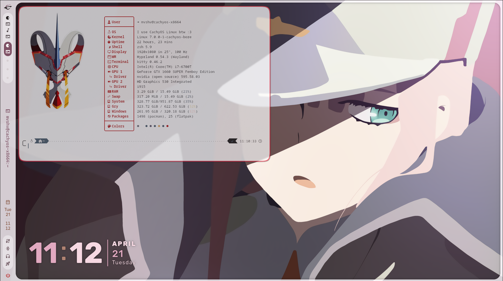

# 🌸  Darling in the Franxx Hyprland Theme 
## By Mvshv
### Hope you’ll like it! :)

---

## 👀 Preview



---

## 🤔 What is it?
A minimalist Hyprland theme inspired by anime Darling in the Franxx.

## 🛠️ System Specs
* **OS:** CachyOS (Linux)
* **WM:** Hyprland
* **Shell:** Zsh
* **Terminal:** Kitty
* **Fetch Tool:** Fastfetch

## 📦 Other stuff u need:
* **[Caelestia Shell](https://github.com/Caelestia-OS/caelestia-shell)** - Sidebar, app drawer, and that awesome dashboard panel.
* **Nautilus** - File management. (Tela-circle-icon-theme)
* **Vivaldi** - Default browser (Easily changeable in `hyprland.conf`).
* **Cavasik** - Cava
* **tty-clock** - Clock
* **Wofi** - if u want to edit config easily
> [!TIP]
> I recommend to copy my zsh, hyprland config is modular, so if u want good-looking list of sections there's alias and script for that

---

# ⚠️ Important Note! 
## Please check before applying.

This theme was tailored for **my specific hardware** (NVIDIA/Intel setup). Paths and monitor settings (1920x1080@100Hz) are hardcoded. Review the files to avoid black screens or config errors.

### 💡 My Advice:
If you want to use my `.zshrc`, **don't copy the entire file**. Instead, only copy the section below:
`--- GO AHEAD RÓB CO CHCESZ ---`
The parts above are system-specific and might break your shell on different distributions!

## 📥 Installation

U have two ways:

### 🛠️ 1: Using Terminal 
1. Open your terminal.
2. Clone the repository:
   ```bash
   git clone https://github.com/mvshv010110/Darling-in-the-Franxx-Hyprland.git
3. Enter copied repo:
   ```bash
   cd Darling-in-the-Franxx-Hyprland
5. Copy-paste files (remember to check 'em first!) and make ur pc look cool
### 🛠️ 2: Manually
1. Click green "<>Code" button on top and "Download ZIP"
2. Extract ZIP
3. Copy-paste files (remember to check 'em first!) and make ur pc look cool
